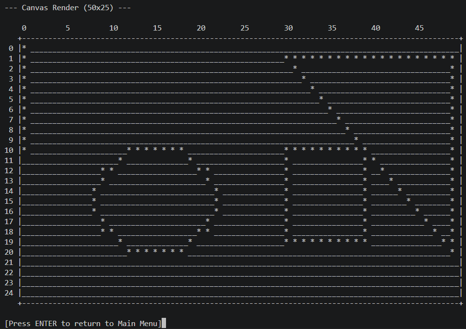
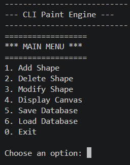

#  2D Graphics Editor Canvas

<div align="center">

### A Terminal-Based 2D Graphics Editor Written in C

Create, edit, render, and persist geometric shapes on a text-based canvas using classic computer graphics algorithms.



</div>

---

##  Overview

CLI Paint Engine is a menu-driven 2D graphics editor built entirely in C. It simulates a drawing environment using a 2D character array as a virtual canvas, allowing users to create and manage graphical objects directly from the terminal.

The application supports shape creation, modification, deletion, rendering, and persistent storage through a binary save system. It demonstrates core concepts of computer graphics, data structures, file handling, and algorithm implementation.

---

##  Features

###  Shape Management

- Add new graphical objects
- Modify existing objects
- Delete objects from the canvas
- Automatic unique ID assignment
- Shape database management

###  Supported Shapes

- Line
- Rectangle
- Circle
- Triangle

###  Canvas Rendering

- Fixed-size 50 × 25 drawing canvas
- Coordinate ruler system
- Bordered rendering area
- Layered shape rendering
- Real-time display generation

###  Persistence System

- Save work to disk
- Load previous sessions
- Binary serialization
- Shape database restoration
- Save file integrity protection

###  Input Validation

- Coordinate boundary checking
- Shape dimension validation
- Invalid menu handling
- Database overflow protection

---

#  Application Preview

## Main Menu



The application provides a simple menu-driven interface for managing graphical objects and rendering the canvas.

---

## Canvas Rendering Example


Example output containing multiple graphical objects rendered on the terminal canvas.

---

##  Graphics Algorithms Used

### Bresenham's Line Algorithm

Used for efficient rasterization of straight lines with integer arithmetic.

### Hollow Rectangle Rendering

Constructed by drawing four connected edges.

### Triangle Rendering

Generated by connecting three vertices using line segments.

### Aspect Ratio Corrected Circle Rendering

Uses a modified midpoint ellipse approach to compensate for terminal character dimensions and produce visually accurate circles.

---

##  Project Structure

```text
CLI-Paint-Engine
│
├── images
│   ├── main_menu.png
│   └── canvas_output.png
│
├── canvas_editor.c
├── README.md
├── .gitignore
│
├── canvas_editor.exe      (generated)
└── engine_save.dat        (generated)
```

---

##  Requirements

### Compiler

Any C compiler supporting ANSI C.

Examples:

- GCC
- MinGW GCC
- Clang

### Operating Systems

- Windows
- Linux
- macOS

---

## Building and Running

### Linux / macOS

```bash
gcc canvas_editor.c -o canvas_editor
./canvas_editor
```

### Windows (MinGW)

```bash
gcc canvas_editor.c -o canvas_editor.exe
canvas_editor.exe
```

---

##  How To Use

### Step 1 — Launch Program

Run the canva_editor.c .

The Main Menu will appear.

### Step 2 — Add Shapes

Choose:

```text
1. Add Shape
```

Then select a shape type:

```text
0. Line
1. Rectangle
2. Circle
3. Triangle
```

---

### Step 3 — Enter Coordinates

#### Line

```text
X1 Y1 X2 Y2
```

Example:

```text
0 0 20 10
```

---

#### Rectangle

```text
X Y Width Height
```

Example:

```text
10 5 15 8
```

---

#### Circle

```text
CenterX CenterY Radius
```

Example:

```text
20 10 5
```

---

#### Triangle

```text
X1 Y1 X2 Y2 X3 Y3
```

Example:

```text
5 5 20 5 12 15
```

---

### Step 4 — Render Canvas

Choose:

```text
4. Display Canvas
```

to visualize all active shapes.

---

### Step 5 — Save Your Work

Choose:

```text
5. Save Database
```

This creates:

```text
engine_save.dat
```

---

### Step 6 — Resume Later

Choose:

```text
6. Load Database
```

to restore previously saved shapes.

---

##  Canvas Specifications

| Property | Value |
|-----------|-----------|
| Width | 50 |
| Height | 25 |
| Maximum Shapes | 100 |
| Background Character | _ |
| Drawing Character | * |
| Storage Format | Binary |

---

##  Technical Highlights

- ANSI C implementation
- Struct + Union based object storage
- 2D character-array canvas
- Binary file serialization
- Modular rendering engine
- Shape database architecture
- Coordinate-based drawing system
- Terminal visualization

---


##  Author

**Ali Mohammed Yaseen**  
R25EH014  
B.Tech AI & Data Science - A

---
